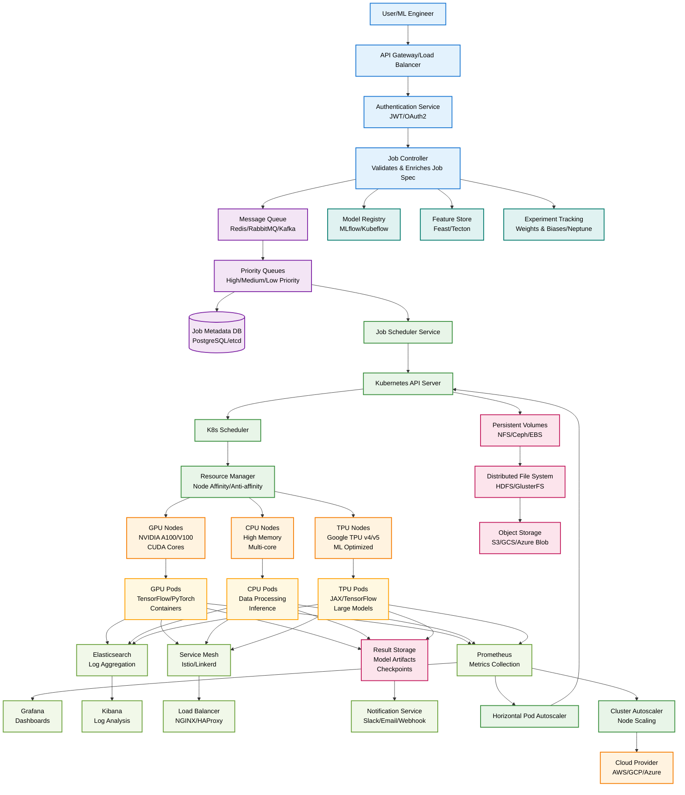

# Detailed ML Job Flow in Distributed Job Scheduler

## Detailed Component Architecture

### Job Submission & API Layer
- **API Gateway**: Rate limiting, request routing, SSL termination
- **Authentication**: JWT tokens, OAuth2, RBAC policies
- **Job Controller**: Validates job specs, enriches with defaults, cost estimation

### Queue & Message System
- **Message Queue**: Redis for speed, Kafka for durability, RabbitMQ for complex routing
- **Priority Queues**: Separate queues for different priority levels
- **Metadata DB**: PostgreSQL for complex queries, etcd for configuration

### Kubernetes Orchestration
- **K8s Scheduler**: Custom schedulers for ML workloads
- **Resource Manager**: GPU/CPU/memory allocation, node affinity rules
- **Horizontal Pod Autoscaler**: Scale pods based on CPU/memory/custom metrics
- **Cluster Autoscaler**: Add/remove nodes based on demand

### Hardware Infrastructure
- **GPU Nodes**: NVIDIA A100/V100 for training, T4 for inference
- **CPU Nodes**: High-memory instances for data processing
- **TPU Nodes**: Google TPUs for large model training
- **Network**: High-bandwidth interconnects (InfiniBand, 100GbE)

### Storage Systems
- **Persistent Volumes**: NFS for shared storage, EBS for performance
- **Distributed FS**: HDFS for big data, Ceph for object storage
- **Object Storage**: S3/GCS for model artifacts, datasets

### ML-Specific Components
- **Model Registry**: Version control for models, metadata tracking
- **Feature Store**: Centralized feature management, real-time serving
- **Experiment Tracking**: Hyperparameter logging, metric comparison

### Monitoring & Observability
- **Prometheus**: Time-series metrics, alerting rules
- **Grafana**: Visualization dashboards, SLA monitoring
- **ELK Stack**: Centralized logging, error tracking
- **Service Mesh**: Traffic management, security policies 