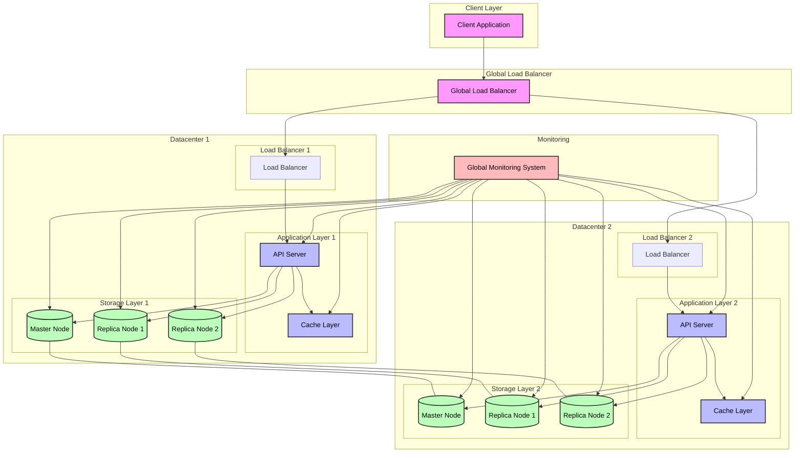

# Key Value Store Architecture Diagram

# Multi-Datacenter Key-Value Store System Design

This diagram illustrates a distributed key-value store system with multiple datacenters and cross-datacenter replication.

## Components

1. **Client Layer**
   - Client applications that interact with the system

2. **Global Load Balancer**
   - Routes requests to appropriate datacenter
   - Handles geographic load balancing
   - Provides disaster recovery capabilities

3. **Datacenter Components**
   Each datacenter contains:
   - **Load Balancer**: Distributes requests within the datacenter
   - **Application Layer**:
     - API Server: Handles client requests and business logic
     - Cache Layer: Improves read performance with in-memory caching
   - **Storage Layer**:
     - Master Node: Handles write operations and data consistency
     - Replica Nodes: Provide read scalability and data redundancy

4. **Cross-Datacenter Replication**
   - Synchronous replication between master nodes
   - Asynchronous replication between replica nodes
   - Ensures data consistency across datacenters

5. **Global Monitoring System**
   - Tracks system health and performance across all datacenters
   - Monitors replication status and latency
   - Provides global system visibility

## Key Features

- **Multi-Datacenter Architecture**: Ensures high availability and disaster recovery
- **Cross-Datacenter Replication**: Maintains data consistency across regions
- **Geographic Distribution**: Reduces latency for global users
- **High Availability**: Multiple replicas within and across datacenters
- **Scalability**: Horizontal scaling through multiple nodes and datacenters
- **Consistency**: Master-replica architecture with cross-datacenter replication
- **Performance**: Local caching and geographic load balancing
- **Monitoring**: Comprehensive global system monitoring 