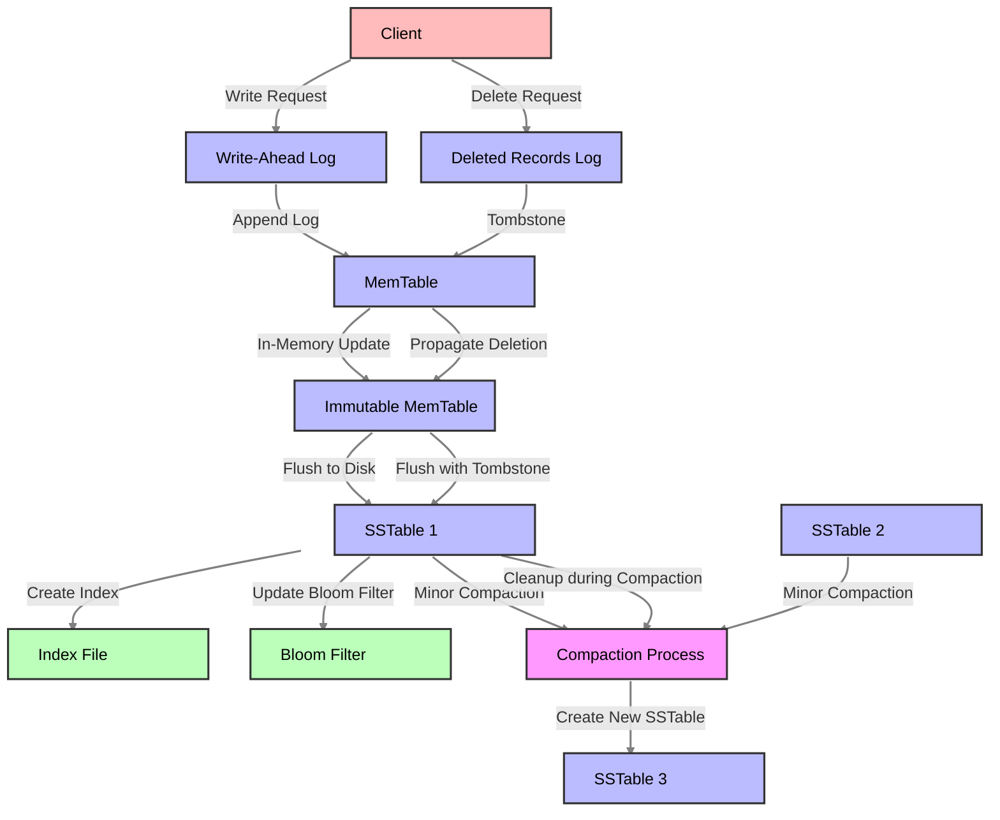

# Key-Value Store Write Path and Deletion Process

This diagram illustrates the detailed write path and deletion process in a key-value store system.

## Write Path Components

Write-Ahead Log (WAL)
- First point of persistence
- Ensures durability before in-memory updates
- Sequential write for better performance
- Used for crash recovery

MemTable
- In-memory data structure (usually skip list or B-tree)
- Sorted by key for efficient lookups
- Holds recent writes
- Limited by memory size

Immutable MemTable
- Read-only copy of MemTable
- Created when MemTable reaches size threshold
- Allows new writes to continue in new MemTable
- Being flushed to disk in background

SSTable (Sorted String Table)
- Immutable on-disk data structure
- Sorted by key
- Contains data blocks and index blocks
- Multiple levels (L0, L1, etc.)

Bloom Filter
- Probabilistic data structure
- Quickly determines if key might exist
- Reduces unnecessary disk reads
- False positives possible, no false negatives

Index File
- Maps keys to data block locations
- Sparse index for space efficiency
- Binary searchable
- Cached in memory

## Write Process Flow

1. Write request received from client
2. Append to WAL for durability
3. Update MemTable in memory
4. When MemTable is full:
   - Create new MemTable
   - Convert old MemTable to Immutable
   - Flush Immutable MemTable to SSTable
5. Create/update index and Bloom filter
6. Perform compaction when needed

## Deletion Process

Tombstone Creation
- Special deletion marker written
- Propagates through all layers
- Indicates key is deleted

Deletion Flow
- Write tombstone to WAL
- Add tombstone to MemTable
- Flush to SSTable with tombstone
- Clean up during compaction

Compaction Cleanup
- Removes old versions of keys
- Removes tombstones for deleted keys
- Merges multiple SSTables
- Creates new compacted SSTable

## Key Features

Durability: WAL ensures data persistence
Performance: In-memory writes for speed
Space Efficiency: Compaction reduces space usage
Read Optimization: Bloom filters and indexes
Crash Recovery: WAL-based recovery
Consistency: Atomic writes and proper deletion handling 