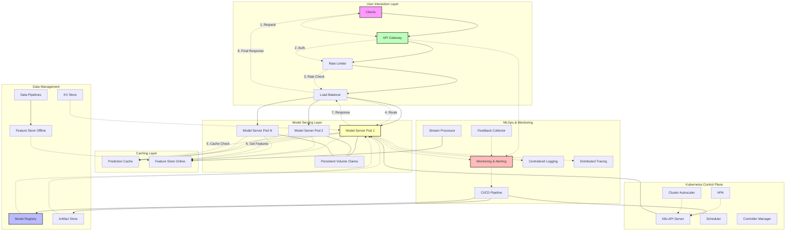

# ML Inference System Architecture

This diagram illustrates a comprehensive ML inference system architecture, incorporating key components like client interaction layers, the core Kubernetes-based inference platform, and supporting systems for monitoring, logging, and CI/CD.

## System Architecture Diagram

## Key Components Explained

### User Interaction Layer
* Clients: Web applications, mobile apps, and other services
* API Gateway: Central entry point with authentication and routing  
* Rate Limiter: Protects backend resources from overload
* Load Balancer: Distributes traffic and handles SSL termination

### Kubernetes Control Plane  
* K8s API Server: Core Kubernetes control component
* Scheduler: Assigns pods to nodes
* Controller Manager: Manages cluster state
* HPA: Horizontal Pod Autoscaler for scaling
* Cluster Autoscaler: Manages node scaling

### Model Serving Layer
* Model Server Pods: Handle inference requests
* Persistent Volume Claims: Local storage for model artifacts

### Caching Layer
* Prediction Cache: Caches inference results for performance
* Feature Store Online: Real-time feature serving

### Data Management
* Model Registry: Version control for models
* Artifact Store: Storage for model files and configs
* Feature Store Offline: Historical feature data
* KV Store: Metadata and configuration storage
* Data Pipelines: ETL processes for features

### MLOps & Monitoring
* Monitoring & Alerting: System health and performance tracking
* Centralized Logging: Log aggregation and analysis
* Distributed Tracing: Request flow tracking
* CI/CD Pipeline: Automated deployment processes
* Stream Processor: Real-time data processing
* Feedback Collector: Model performance feedback

## Request Flow

1. Client Request → API Gateway handles authentication and routing
2. Rate Limiting → Quota management and traffic control  
3. Load Balancing → Intelligent routing to available model pods
4. Model Processing → Cache lookup, feature retrieval, inference execution
5. Response Path → Results flow back through the same layers
6. Monitoring → All components emit metrics and logs for observability

This architecture supports scalable, reliable, and high-performance ML inference workloads with proper separation of concerns and comprehensive monitoring.
