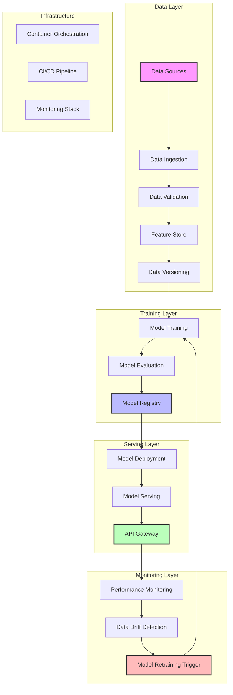

# Modern ML System Flow Diagram

This diagram illustrates the key components and flow of a modern Machine Learning system, from data ingestion to model deployment and monitoring.

## Key Components Explained

### Data Layer
- **Data Sources**: Raw data from various sources (databases, APIs, streaming)
- **Data Ingestion**: ETL/ELT processes for data collection
- **Data Validation**: Schema validation and data quality checks
- **Feature Store**: Centralized feature management and serving
- **Data Versioning**: Tracking data lineage and versions

### Training Layer
- **Model Training**: Automated training pipelines
- **Model Evaluation**: Performance metrics and validation
- **Model Registry**: Version control for models

### Serving Layer
- **Model Deployment**: Containerized model deployment
- **Model Serving**: Real-time inference service
- **API Gateway**: Request routing and load balancing

### Monitoring Layer
- **Performance Monitoring**: Real-time model metrics
- **Data Drift Detection**: Monitoring data distribution changes
- **Model Retraining Trigger**: Automated retraining based on drift

### Infrastructure
- **Container Orchestration**: Kubernetes or similar
- **CI/CD Pipeline**: Automated testing and deployment
- **Monitoring Stack**: Logging, metrics, and alerting 